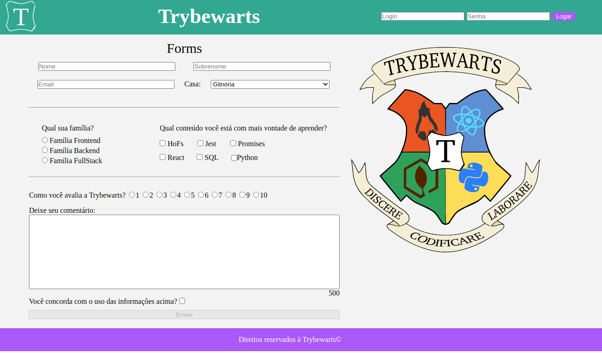

# PROJETO TRYBEWARTS

#### Este foi o meu primeiro projeto na **Trybe**, Ele tem como objetivo mostrar meus conhecimentos em **HTML**, **manipulação DOM**,  **Javascript**, **Criação de Formulário** e **css**.
---
 

### **Tecnologias utilizadas**
---
---

</img>
</img>
</img>

---
---
 
 

## **SOBRE:**
---
 Neste projeto, temos um formulário a ser preenchido. Para enviar os dados do Formulário, é obrigatório marcar a caixa de seleção **Você concorda com o uso das informações acima?** .  
 Sem a marcação desta caixa de seleção, o botão de enviar estará desativado.  
 
 Temos também um campo de login, onde para validar o login, o usuário deve por um email válido, como exemplo : **alguem@alguem.com**, junto com uma senha numérica de no mínimo **6 dígitos**.  
 Caso o Login esteja no formato incorreto, aparecerá um alerta informado ao usuário, e caso o login esteja no formato correto, irá aparecer um alerta informado ao usuário.  
 Ao clicar no botão **Enviar**, irá aparecer na tela os dados preenchidos pelo usuário.
 
 

## EXEMPLO
---
## Aqui a baixo podemos ver uma pequena simulação de como funciona

## Caso queira ver na prática como funciona, acesse o link abaixo: 
---

https://douglassantosf.github.io/project-trybeWarts/
